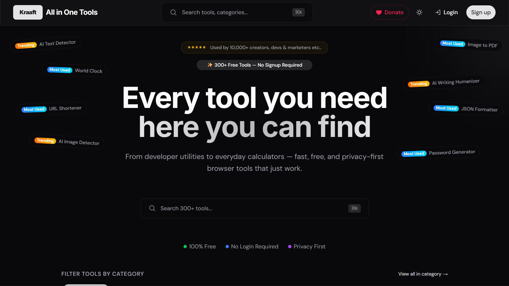

# Kraaft

Kraaft is a Turborepo monorepo for a browser-based collection of free online tools across productivity, developer, PDF, design, media, and everyday utility categories.

Created and maintained by Maniesh Sanwal.

## Maintainer

- Maintainer: Maniesh Sanwal
- Portfolio: [manieshsanwal.in](https://manieshsanwal.in)

[Live site](https://kraaft.manieshsanwal.in)

[](https://kraaft.manieshsanwal.in)

## What is inside

- Next.js 16 app with App Router and Turbopack in development
- Shared UI package used across the workspace
- Registry-driven tool pages and category pages
- Authentication with email/password and Google OAuth
- User features like pinned tools and saved outputs
- 300+ tools listed in the registry, with 200+ already implemented and live

## Tech stack

- Next.js
- React 19
- TypeScript
- Tailwind CSS v4
- Turborepo
- MongoDB + Mongoose
- JWT auth
- Zod
- Framer Motion

Selected libraries:

- `pdf-lib`, `pdfjs-dist`, `@pdfsmaller/pdf-encrypt-lite`
- `papaparse`, `js-yaml`, `jszip`
- `qrcode.react`, `jsbarcode`, `@phosphor-icons/react`
- `bcryptjs`, `jsonwebtoken`, `nodemailer`
- `exifreader`, `svgo`, `tesseract.js`, `whois-json`

## Monorepo layout

```text
apps/
  web/                  # Main Next.js application
packages/
  ui/                   # Shared UI components
  eslint-config/        # Shared ESLint config
  typescript-config/    # Shared TypeScript config
```

Important app paths:

- `apps/web/app/[category]/page.tsx`
- `apps/web/app/[category]/[tool]/page.tsx`
- `apps/web/lib/tools-registry.ts`
- `apps/web/lib/categories.ts`
- `apps/web/components/tools/`

## Getting started

### Prerequisites

- Node.js `>=20`
- npm with workspaces enabled

### Install

```bash
npm install
```

### Environment variables

Create `apps/web/.env.local`:

```env
MONGODB_URI=

ACCESS_TOKEN_SECRET=
REFRESH_TOKEN_SECRET=
ACCESS_TOKEN_EXPIRES_IN=15m
REFRESH_TOKEN_EXPIRES_IN=7d

SMTP_HOST=
SMTP_PORT=587
SMTP_USER=
SMTP_PASS=
EMAIL_FROM=

NEXT_PUBLIC_APP_URL=http://localhost:3000
NEXT_PUBLIC_GOOGLE_CLIENT_ID=
```

### Run locally

```bash
npm run dev
```

Then open `http://localhost:3000`.

## Root scripts

- `npm run dev` - run the workspace in development
- `npm run build` - production build
- `npm run lint` - lint all packages
- `npm run typecheck` - type-check all packages
- `npm run format` - format the repo

## Features

- Tool discovery across 36 categories
- Dynamic category and tool routing
- Saved outputs for authenticated users
- Per-user pinned tools
- Shareable links and browser-first utilities
- A growing registry that makes adding new tools straightforward

## Adding a new tool

1. Add the tool entry in `apps/web/lib/tools-registry.ts`
2. Create the tool component under `apps/web/components/tools/<category>/`
3. Wire it in `apps/web/app/[category]/[tool]/page.tsx`
4. Add any persistence or API support if the tool needs it

## Open source

This repository now includes the basic files needed for open-source collaboration:

- `LICENSE` using the MIT license
- `CONTRIBUTING.md`
- `CODE_OF_CONDUCT.md`
- GitHub issue templates
- GitHub pull request template
- GitHub Actions CI workflow

If you want to customize the public release further, the next good steps are:

- Add issue labels and project boards
- Add screenshots or demos for the most important tools
- Review secrets, branding assets, and deployment-specific config before making the repo public

## Contributing

Contributions are welcome.

Project maintainer: Maniesh Sanwal

Suggested workflow:

1. Fork the repo
2. Create a feature branch
3. Make focused changes
4. Run `npm run typecheck` and `npm run lint`
5. Open a pull request with a clear summary

When contributing:

- Keep changes scoped
- Follow the existing folder structure
- Prefer registry-driven additions instead of hardcoded routes
- Do not commit secrets or real environment values

## Security

- Never commit `.env.local`
- Rotate secrets immediately if any value is exposed
- Use deployment environment variables for production

## Support

If you want to support the project, use the in-app donation section at `/#donate`.

UPI used in the app: `kraaft@ptaxis`
